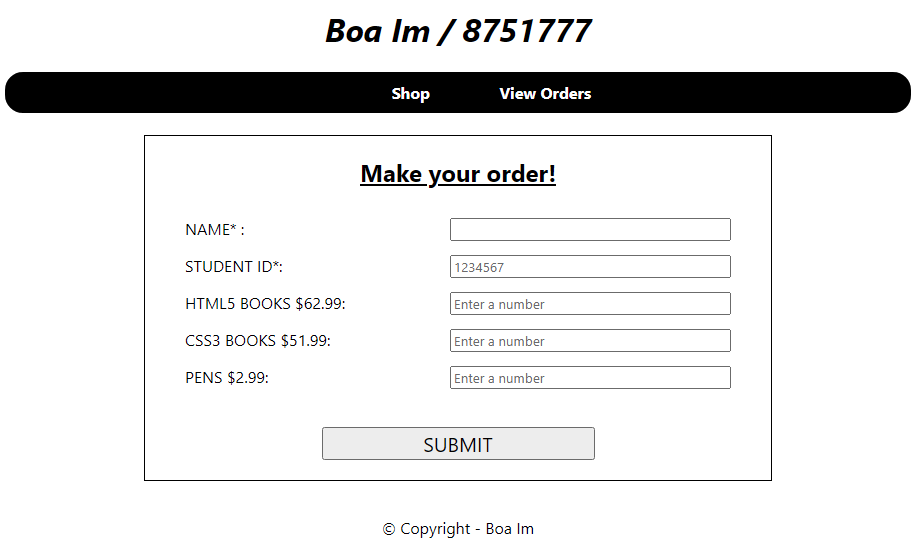
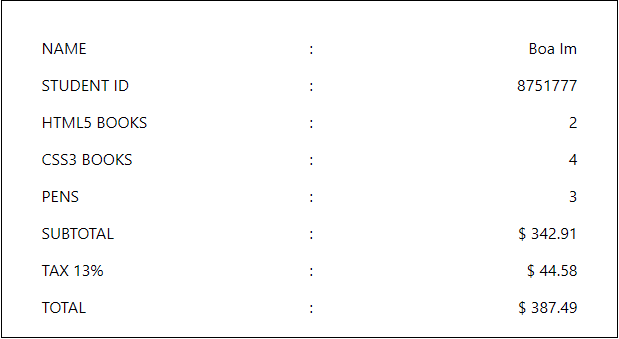
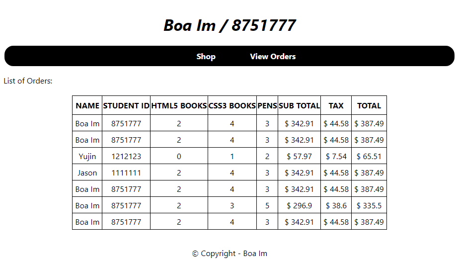

<h1>Book Store Web</h1>

This was made for an academic project of Dynamic Website class at Conestoga College.

<ul>
  <li>Build a <strong>Node.js</strong> web page that allows user to buy a number of books and view the receipt with subtotal, tax, and total price</li>
  <li>Save the information of buyer by checking server-side validation to <strong>MongoDB</strong> and show all orders from the database</li>
</ul>
<h5>How to run this code?</h5>

You should have visual studio installed C# and .NET
   Tool -> NuGet Package Manager -> NuGet Package Console
   In the <strong>NuGet Package Console</strong>, type 'update-database'
   Now, you can see the saved database in 'View -> SQL Server Object Explorer'

 

  <h4>1. Main Page</h4>
  

  <h4>2. Receipt</h4>
  
  
You can get the receipt with subtotal, tax, and total price after ordering books

  <h4>3. View Order Page</h4>
  
  
You can check the your previous orders

